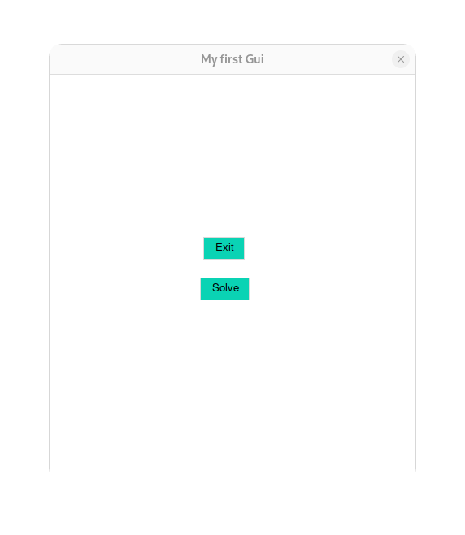

# My first graphical interface

$$
m \frac{d^2x(t)}{dt^2} + c \frac{dx(t)}{dt} + k x(t) = 0
$$

# Pomodoro time

  

# Pomodoro break

  

  

# Sistema de dos pendulos acoplados

$$
\begin{cases}
\ddot{x}_1 + \frac{k}{m_1 l_1} (x_1 - x_2) + g \frac{x_1}{l_1} = 0 \\
\ddot{x}_2 + \frac{k}{m_2 l_2} (x_2 - x_1) + g \frac{x_2}{l_2} = 0
\end{cases}
$$
