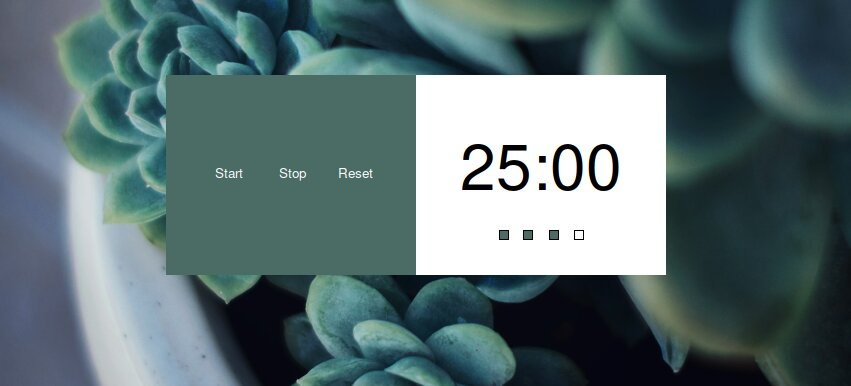
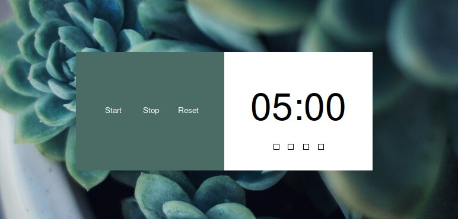

# My First Graphical Interface

## Tabla de Contenidos
1. [Pomodoro](#pomodoro)
2. [Sistema de dos péndulos acoplados](#sistema-de-dos-péndulos-acoplados)
3. [Densidad de probabilidad del átomo de hidrógeno](#densidad-de-probabilidad-del-átomo-de-hidrógeno)

---

## Pomodoro

<p align="center">
  
</p>

<p align="center">
  
</p>

---

## Sistema de dos péndulos acoplados

<p align="center">
  
</p>

$$
\begin{cases}
\ddot{x}_1 + \frac{k}{m_1 } (x_1 - x_2) + g \frac{x_1}{l_1} = 0 \\
\ddot{x}_2 + \frac{k}{m_2 } (x_2 - x_1) + g \frac{x_2}{l_2} = 0
\end{cases}
$$

<p align="center">
  
</p>

### Código en Python

```python
import tkinter as tk
import matplotlib.pyplot as plt
import numpy as np
from matplotlib.backends.backend_tkagg import FigureCanvasTkAgg
from scipy.integrate import solve_ivp

window = tk.Tk()
window.config(bg="#ffffff")
window.minsize(1000, 450)
window.maxsize(1000, 450)

left_frame = tk.Frame(window, width=200, height=450, bg="#009b88")
left_frame.pack(side=tk.LEFT, fill=tk.BOTH, expand=False)
left_frame.pack_propagate(False)

right_frame = tk.Frame(window, width=800, height=450, bg="#ffffff")
right_frame.pack(side=tk.RIGHT, fill=tk.BOTH, expand=False)
right_frame.pack_propagate(False)

x1_0_entry = tk.Entry(left_frame, width=6)
x1_0_entry.place(relx=0.4, rely=0.4, anchor='center')

x1_0 = tk.Label(left_frame, text=r'x1(t=0)', fg='#ffffff', bg='#009b88')
x1_0.place(relx=0.4, rely=0.35, anchor='center')

v1_0_entry = tk.Entry(left_frame, width=6)
v1_0_entry.place(relx=0.7, rely=0.4, anchor='center')

v1_0 = tk.Label(left_frame, text=r'v1(t=0)', fg='#ffffff', bg='#009b88')
v1_0.place(relx=0.7, rely=0.35, anchor='center')

x2_0_entry = tk.Entry(left_frame, width=6)
x2_0_entry.place(relx=0.4, rely=0.55, anchor='center')

x2_0 = tk.Label(left_frame, text=r'x2(t=0)', fg='#ffffff', bg='#009b88')
x2_0.place(relx=0.4, rely=0.5, anchor='center')

v2_0_entry = tk.Entry(left_frame, width=6)
v2_0_entry.place(relx=0.7, rely=0.55, anchor='center')

v2_0 = tk.Label(left_frame, text=r'v2(t=0)', fg='#ffffff', bg='#009b88')
v2_0.place(relx=0.7, rely=0.5, anchor='center')

canvas = None

# Función para graficar
def graficar():
    global canvas

    m = 1.0     # masa (kg)
    l = 1.0     # longitud (m)
    g = 9.81    # gravedad (m/s^2)
    k = 1.0     # constante del resorte (N/m)
    
    def ecuaciones(t, y):
        x1, v1, x2, v2 = y
        dx1_dt = v1
        dx2_dt = v2
        dv1_dt = - (g / l) * x1 - (k / m) * (x1 - x2)
        dv2_dt = - (g / l) * x2 - (k / m) * (x2 - x1)
        return [dx1_dt, dv1_dt, dx2_dt, dv2_dt]
    
    # Obtén los valores de las entradas
    x1_0 = float(x1_0_entry.get())
    v1_0 = float(v1_0_entry.get())
    x2_0 = float(x2_0_entry.get())
    v2_0 = float(v2_0_entry.get())
    
    y0 = [x1_0, v1_0, x2_0, v2_0]
    
    t_span = (0, 30)               # intervalo de tiempo (s)
    t_eval = np.linspace(0, 30, 500)  # puntos de evaluación
    
    sol = solve_ivp(ecuaciones, t_span, y0, t_eval=t_eval, method='RK45')
    
    plt.rcParams['toolbar'] = 'none'
    fig = plt.figure(figsize=(5, 4))  # Ajusta el tamaño de la figura para el frame
    
    plt.plot(sol.t, sol.y[0], label=r'$x_1$ (m)', color='#000000')
    plt.plot(sol.t, sol.y[2], label=r'$x_2$ (m)', color='#009b88')
    plt.xlabel('Tiempo (s)')
    plt.ylabel('Desplazamiento (m)')
    plt.xlim(0, 30)
    plt.legend()
    
    canvas = FigureCanvasTkAgg(fig, master=right_frame)
    canvas.draw()
    canvas.get_tk_widget().pack(side=tk.TOP, fill="both", expand=1)


def limpiar_grafica():
    global canvas
    if canvas is not None:
        canvas.get_tk_widget().pack_forget()  
        canvas = None  

def cerrar():
    window.quit()

solve_button = tk.Button(left_frame, text="Solve", command=graficar)
solve_button.config(bg="#009b88", fg="#ffffff", borderwidth=0, highlightthickness=0, relief="flat")
solve_button.place(relx=0.4, rely=0.8, anchor="center")

cerrar_button = tk.Button(left_frame, text="Close", command=cerrar)
cerrar_button.config(bg="#009b88", fg="#ffffff", borderwidth=0, highlightthickness=0, relief="flat")
cerrar_button.place(relx=0.4, rely=0.9, anchor="center")

clean_button = tk.Button(left_frame, text="Clean", command=limpiar_grafica)
clean_button.config(bg="#009b88", fg="#ffffff", borderwidth=0, highlightthickness=0, relief="flat")
clean_button.place(relx=0.7, rely=0.8, anchor="center")

window.mainloop()
```

# Colitions in Python 

```python
import numpy as np
import matplotlib.pyplot as plt
from matplotlib import rc
from matplotlib.animation import FuncAnimation

v1 = 2
m1 = 1
m2 = 1

alpha = np.radians(35)
beta  = np.radians(45)

v1f_magnitud = v1 / (np.cos(beta) + (np.sin(beta) * np.cos(alpha))/ np.sin(alpha))
v2f_magnitud = (m1 / m2) * (np.sin(beta) / np.sin(alpha)) * v1f_magnitud

v1f = np.array([v1f_magnitud * np.cos(beta), v1f_magnitud * np.sin(beta)]) # [vx, vy]
v2f = np.array([v2f_magnitud * np.cos(alpha), -v2f_magnitud * np.sin(alpha)]) # [vx, -vy]

p1  = np.array([-5, 0])
p2  = np.array([0, 0])

v1i = np.array([v1, 0])
v2i = np.array([0, 0])

fig = plt.figure()
plt.xlim(-10, 10)
plt.ylim(-10, 10)

plt.axvline(0, color="gray")
plt.axhline(0, color="gray")

m1, = plt.plot([0], [0], "o", color="#c60072",  markersize=20)
m2, = plt.plot([-5], [0], "o", color="#2dc2ff", markersize=20)

t_col = abs(p1[0] / v1i[0])    # d = vt -> d/ v = t

def init():
  m1.set_data([p1[0]], [p1[1]])
  m2.set_data([p2[0]], [p2[1]])
  return m1, m2

def animate(t):

  if t < t_col:
    
    x1 = p1[0] + v1i[0] * t
    y1 = p1[1]
    
    x2 = p2[0]
    y2 = p2[1]

  else:
    x1 = p2[0] + v1f[0] * (t - t_col)
    y1 = p2[1] + v1f[1] * (t - t_col)
    
    x2 = p2[0] + v2f[0] * (t - t_col)
    y2 = p2[1] + v2f[1] * (t - t_col)

  m1.set_data([x1], [y1])

  # Tamaño de la masa
  size = 20 + 1.5 * t
  
  m2.set_data([x2], [y2])
  m2.set_markersize(size)
  plt.title(f"t = {t:.2f}")
  


  return m1, m2

ani = FuncAnimation(fig, animate, frames=np.linspace(0, 10, 200), init_func=init, 
                    interval=30, repeat=True)


plt.show()
```
<div align="center">
  
</div>

# Implementación de botones

```python
import tkinter as tk
import matplotlib.pyplot as plt
import numpy as np
from matplotlib.backends.backend_tkagg import FigureCanvasTkAgg
from scipy.integrate import solve_ivp
from matplotlib.animation import FuncAnimation

window = tk.Tk()
window.config(bg="#ffffff")
window.minsize(1000, 450)
window.maxsize(1000, 450)

left_frame = tk.Frame(window, width=200, height=450, bg="#009b88")
left_frame.pack(side=tk.LEFT, fill=tk.BOTH, expand=False)
left_frame.pack_propagate(False)

right_frame = tk.Frame(window, width=800, height=450, bg="#ffffff")
right_frame.pack(side=tk.RIGHT, fill=tk.BOTH, expand=False)
right_frame.pack_propagate(False)


# Boton 1 -> velocidad (m/1) inicial de m1 

v1_0_entry = tk.Entry(left_frame, width=6)
v1_0_entry.place(relx=0.4, rely=0.4, anchor='center')
v1_0 = tk.Label(left_frame, text=r'v1i', fg='#ffffff', bg='#009b88')
v1_0.place(relx=0.4, rely=0.35, anchor='center')

# Boton 2 -> masa m1 (kg)

m1_0_entry = tk.Entry(left_frame, width=6)
m1_0_entry.place(relx=0.7, rely=0.4, anchor='center')
m1_0 = tk.Label(left_frame, text=r'm1', fg='#ffffff', bg='#009b88')
m1_0.place(relx=0.7, rely=0.35, anchor='center')


canvas = None

def graficar():
    global canvas
    limpiar_grafica()

    v1 = float(v1_0_entry.get())
    m1 = np.random.randint(1, 5) #float(m1_0_entry.get())
    print(m1)
    
    m2 = 1
    
    alpha = np.radians(np.random.randint(10, 60))
    beta  = np.radians(np.random.randint(10, 60))
    
    v1f_magnitud = v1 / (np.cos(beta) + (np.sin(beta) * np.cos(alpha))/ np.sin(alpha))
    v2f_magnitud = (m1 / m2) * (np.sin(beta) / np.sin(alpha)) * v1f_magnitud
    
    v1f = np.array([v1f_magnitud * np.cos(beta), v1f_magnitud * np.sin(beta)]) # [vx, vy]
    v2f = np.array([v2f_magnitud * np.cos(alpha), -v2f_magnitud * np.sin(alpha)]) # [vx, -vy]
    
    p1  = np.array([-5, 0])
    p2  = np.array([0, 0])
    
    v1i = np.array([v1, 0])
    v2i = np.array([0, 0])
    
    fig = plt.figure()
    plt.xlim(-10, 10)
    plt.ylim(-15, 15)
    
    plt.axvline(0, color="gray")
    plt.axhline(0, color="gray")
    
    x_detector = [8, 8]
    y_detector = [-10, 10]

    plt.plot(x_detector, y_detector, color="black")

    plt.plot()
    
    m1,  = plt.plot([0], [0], "o", color="#91a6ab",  markersize=10)
    m8,  = plt.plot([0], [2.5], "o", color="#c60072",  markersize=10)
    m9,  = plt.plot([0], [5], "o", color="#c60072",  markersize=10)
    m10, = plt.plot([0], [-2.5], "o", color="#c60072",  markersize=10)
    m11, = plt.plot([0], [-5], "o", color="#c60072",  markersize=10)
    
    
    m2, = plt.plot([-5],[0], "o", color="#c60072", markersize=10)
    
    m3, = plt.plot([5], [5], "o", color="#2dc2ff", markersize=20)
    m4, = plt.plot([5], [2.5], "o", color="#2dc2ff", markersize=20)
    m5, = plt.plot([5], [0], "o", color="#2dc2ff", markersize=20)
    m6, = plt.plot([5], [-2.5], "o", color="#2dc2ff", markersize=20)
    m7, = plt.plot([5], [-5], "o", color="#2dc2ff", markersize=20)
    
    t_col = abs(p1[0] / v1i[0])    # d = vt -> d/ v = t
    
    def init():
      m1.set_data([p1[0]], [p1[1]])
      m2.set_data([p2[0]], [p2[1]])
      return m1, m2
    
    def animate(t):
    
      if t < t_col:
        
        x1 = p1[0] + v1i[0] * t
        y1 = p1[1]
        
        x2 = p2[0]
        y2 = p2[1]
    
      else:
        x1 = p2[0] + v1f[0] * (t - t_col)
        y1 = p2[1] + v1f[1] * (t - t_col)
        
        x2 = p2[0] + v2f[0] * (t - t_col)
        y2 = p2[1] + v2f[1] * (t - t_col)
    
      m1.set_data([x1], [y1])
    
      # Tamaño de la masa
      #size = 20 + 1.5 * t
      
      m2.set_data([x2], [y2])
      #m2.set_markersize(size)
      plt.title(f"t = {t:.2f}")
      
    
    
      return m1, m2
    
    ani = FuncAnimation(fig, animate, frames=np.linspace(0, 10, 200), init_func=init, 
                        interval=30, repeat=True)
    
    
    canvas = FigureCanvasTkAgg(fig, master=right_frame)
    canvas.draw()
    canvas.get_tk_widget().pack(side=tk.TOP, fill="both", expand=1)


def limpiar_grafica():
    global canvas
    if canvas is not None:
        canvas.get_tk_widget().pack_forget()  
        canvas = None  

def cerrar():
    window.destroy()
    window.quit()

solve_button = tk.Button(left_frame, text="Solve", command=graficar)
solve_button.config(bg="#009b88", fg="#ffffff", borderwidth=0, highlightthickness=0, relief="flat")
solve_button.place(relx=0.4, rely=0.8, anchor="center")

cerrar_button = tk.Button(left_frame, text="Close", command=cerrar)
cerrar_button.config(bg="#009b88", fg="#ffffff", borderwidth=0, highlightthickness=0, relief="flat")
cerrar_button.place(relx=0.4, rely=0.9, anchor="center")

clean_button = tk.Button(left_frame, text="Clean", command=limpiar_grafica)
clean_button.config(bg="#009b88", fg="#ffffff", borderwidth=0, highlightthickness=0, relief="flat")
clean_button.place(relx=0.7, rely=0.8, anchor="center")

window.mainloop()


```
# Implementado

```python
import tkinter as tk
import matplotlib.pyplot as plt
import numpy as np
from matplotlib.backends.backend_tkagg import FigureCanvasTkAgg
from scipy.integrate import solve_ivp
from matplotlib.animation import FuncAnimation

window = tk.Tk()
window.config(bg="#ffffff")
window.minsize(1000, 450)
window.maxsize(1000, 450)

left_frame = tk.Frame(window, width=200, height=450, bg="#009b88")
left_frame.pack(side=tk.LEFT, fill=tk.BOTH, expand=False)
left_frame.pack_propagate(False)

right_frame = tk.Frame(window, width=800, height=450, bg="#ffffff")
right_frame.pack(side=tk.RIGHT, fill=tk.BOTH, expand=False)
right_frame.pack_propagate(False)


# Boton 1 -> velocidad (m/1) inicial de m1 

v1_0_entry = tk.Entry(left_frame, width=6)
v1_0_entry.place(relx=0.4, rely=0.4, anchor='center')
v1_0 = tk.Label(left_frame, text=r'v1i', fg='#ffffff', bg='#009b88')
v1_0.place(relx=0.4, rely=0.35, anchor='center')

# Boton 2 -> masa m1 (kg)

m1_0_entry = tk.Entry(left_frame, width=6)
m1_0_entry.place(relx=0.7, rely=0.4, anchor='center')
m1_0 = tk.Label(left_frame, text=r'm1', fg='#ffffff', bg='#009b88')
m1_0.place(relx=0.7, rely=0.35, anchor='center')


canvas = None

def graficar():
    global canvas
    limpiar_grafica()

    v1 = float(v1_0_entry.get())

    m1 = 1    
    m2 = 1
    M  = 14
    
    alpha = np.radians(45)
    beta  = np.radians(45)
    
    # velocidades del primer choque

    v1f_magnitud = v1 / (np.cos(beta) + (np.sin(beta) * np.cos(alpha))/ np.sin(alpha))
    v2f_magnitud = (m1 / m2) * (np.sin(beta) / np.sin(alpha)) * v1f_magnitud
    
    v1f = np.array([v1f_magnitud * np.cos(beta), v1f_magnitud * np.sin(beta)])    # [vx, vy]
    v2f = np.array([v2f_magnitud * np.cos(alpha), -v2f_magnitud * np.sin(alpha)]) # [vx, -vy]
    
    # velocidades despues del primer choque 

    # n -> N
 
    eta   = np.radians(np.random.randint(0, 45)) #n
    theta = np.radians(np.random.randint(0, 45)) #N

    vf_n_2_M = 2  
    vf_N_1_M = 2

    
    vf_n_2 =  np.array([vf_n_2_M * np.cos(eta), -vf_n_2_M * np.sin(eta)]) #[vx, vy]
    vf_N_1 =  np.array([vf_N_1_M * np.cos(theta), vf_N_1_M * np.sin(theta)])

    # p -> N 
    
    kappa   = np.radians(np.random.randint(0, 45)) #p
    gamma   = np.radians(np.random.randint(0, 45)) #N
    
    vf_p_2_M = 2
    vf_N_2_M = 2

    vf_p_2 =  np.array([vf_n_2_M * np.cos(kappa), vf_n_2_M * np.sin(kappa)]) #[vx, vy]
    vf_N_2 =  np.array([vf_N_1_M * np.cos(gamma), -vf_N_1_M * np.sin(gamma)])
    
    p1  = np.array([-5, 0])
    p2  = np.array([0, 0])
    
    v1i = np.array([v1, 0])
    v2i = np.array([0, 0])
    
    fig = plt.figure()
    plt.xlim(-10, 10)
    plt.ylim(-15, 15)
    
    plt.axvline(0, color="gray")
    plt.axhline(0, color="gray")
    
    x_detector = [8, 8]
    y_detector = [-10, 10]

    plt.plot(x_detector, y_detector, color="black")

    plt.plot()
    
    m1,  = plt.plot([0], [0], "o", color="#91a6ab",  markersize=10)
    
    
    m2, = plt.plot([-5],[0], "o", color="#c60072", markersize=10)
    
    N1_r = np.array([5, 5])
    N2_r = np.array([5, -5])

    N1, = plt.plot([N1_r[0]], [N1_r[1]], "o", color="#2dc2ff", markersize=10)
    N2, = plt.plot([N2_r[0]], [N2_r[1]], "o", color="#2dc2ff", markersize=10)
    

    t_col   = abs(p1[0] / v1i[0])
    t_col_2 = abs(N1_r[0] / v1f[0] + t_col)   

    def init():
      m1.set_data([p1[0]], [p1[1]])
      m2.set_data([p2[0]], [p2[1]])
      N1.set_data([N1_r[0]], [N1_r[1]])
      N2.set_data([N2_r[0]], [N2_r[1]])
      return m1, m2, N1, N2
    
    def animate(t):
      
      x3 = N1_r[0] 
      y3 = N1_r[1]
      x4 = N2_r[0]
      y4 = N2_r[1]
    
      if t < t_col:
        
        x1 = p1[0] + v1i[0] * t
        y1 = p1[1]
        
        x2 = p2[0]
        y2 = p2[1]
    
      else:
        x1 = p2[0] + v1f[0] * (t - t_col)
        y1 = p2[1] + v1f[1] * (t - t_col)
        
        x2 = p2[0] + v2f[0] * (t - t_col)
        y2 = p2[1] + v2f[1] * (t - t_col)
        
        if t >= t_col_2:
            x3 =  N1_r[0] + vf_N_1[0] * (t - t_col_2)
            y3 =  N1_r[0] + vf_N_1[1] * (t - t_col_2)

            x1 = N1_r[0] + vf_n_2[0] * (t - t_col_2)
            y1 = N1_r[1] + vf_n_2[1] * (t - t_col_2)

            x2 = N2_r[0] + vf_p_2[0] * ( t - t_col_2)
            y2 = N2_r[1] + vf_p_2[1] * ( t - t_col_2)
            
            x4 = N2_r[0] + vf_N_2[0] * ( t - t_col_2)
            y4 = N2_r[1] + vf_N_2[1] * ( t - t_col_2)
    
      m1.set_data([x1], [y1])
      m2.set_data([x2], [y2])
      N1.set_data([x3], [y3])
      N2.set_data([x4], [y4])
      plt.title(f"t = {t:.2f}")

      return m1, m2, N1, N2
    
    ani = FuncAnimation(fig, animate, frames=np.linspace(0, 5, 200), init_func=init, 
                        interval=30, repeat=False)
    
    
    canvas = FigureCanvasTkAgg(fig, master=right_frame)
    canvas.draw()
    canvas.get_tk_widget().pack(side=tk.TOP, fill="both", expand=1)


def limpiar_grafica():
    global canvas
    if canvas is not None:
        canvas.get_tk_widget().pack_forget()  
        canvas = None  

def cerrar():
    window.destroy()
    window.quit()

solve_button = tk.Button(left_frame, text="Solve", command=graficar)
solve_button.config(bg="#009b88", fg="#ffffff", borderwidth=0, highlightthickness=0, relief="flat")
solve_button.place(relx=0.4, rely=0.8, anchor="center")

cerrar_button = tk.Button(left_frame, text="Close", command=cerrar)
cerrar_button.config(bg="#009b88", fg="#ffffff", borderwidth=0, highlightthickness=0, relief="flat")
cerrar_button.place(relx=0.4, rely=0.9, anchor="center")

clean_button = tk.Button(left_frame, text="Clean", command=limpiar_grafica)
clean_button.config(bg="#009b88", fg="#ffffff", borderwidth=0, highlightthickness=0, relief="flat")
clean_button.place(relx=0.7, rely=0.8, anchor="center")

window.mainloop()


```

